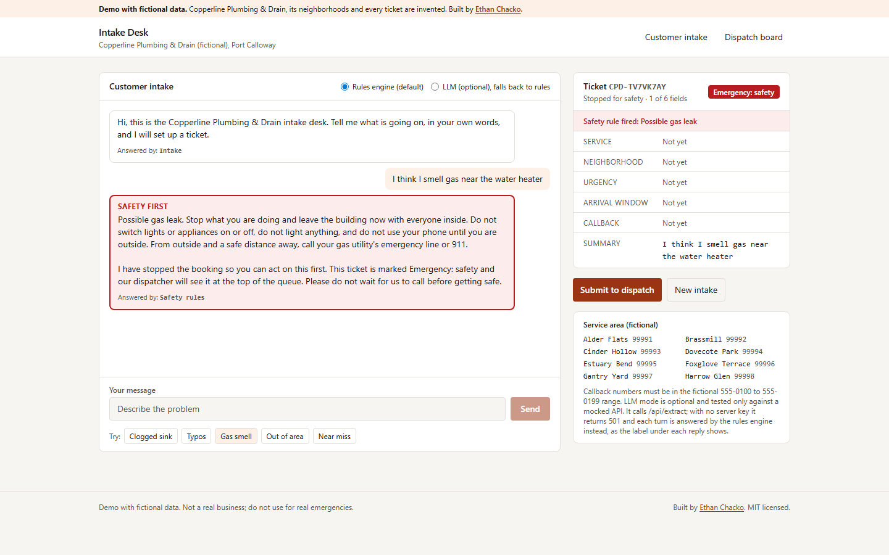

# Intake Desk: job intake with safety routing, a rules engine and an optional LLM adapter

A chat intake and dispatch board for a fictional plumbing company. The intake turns free-text customer messages into a structured job ticket, and hard-coded safety rules take over whenever a message describes a gas, carbon monoxide or water-near-electrical hazard.

**Live demo:** https://intake-desk-ten.vercel.app (fictional data)



## What this demonstrates

- **Safety rules that no extractor can override.** `processMessage` runs `detectSafety` on every message before any extractor is called. The machine re-validates every extraction, and no extractor field can express `emergency-safety`. Tests cover all three points, including a hostile extractor.
- **A swappable `Extractor` interface with two implementations.** The deterministic `RuleExtractor` is the default. `LlmExtractor` calls a server route that uses tool use with a JSON schema. Any failure falls back to the rules engine, and each reply shows which engine actually answered.
- **Untrusted model output is validated, not trusted.** The LLM adapter checks the tool input against the same schema it sends. Off-schema output falls back. The LLM path is tested with a mocked `fetch` for valid output, malformed output, HTTP errors, network errors and a missing key.
- **A measured eval instead of a claimed one.** `npm run eval` scores 62 fictional messages field by field. It reports cases written before and after the rules were frozen separately, and fails the run if safety recall drops below 100 percent.
- **A one-question-at-a-time state machine.** It covers out-of-area decline with referral, NANP phone validation, and emergency handling that skips the arrival-window question.

## Live demo

Live demo: https://intake-desk-ten.vercel.app

## Run it

```
npm install
npm run dev        # http://localhost:3000
npm test           # vitest, 163 tests
npm run eval       # scores the rules engine, writes evals/RESULTS.md
npm run typecheck
npm run build
```

Node 22. No keys are needed. Everything runs offline.

## How it works

```
customer message
      |
      v
detectSafety (src/lib/safety/detect.ts) --hit--> fixed instructions (src/lib/safety/safety-text.ts)
      |                                           ticket = safety-stop, priority emergency-safety
      | no hit                                    extractor is never called
      v
Extractor.extract(text, { awaiting })
   RuleExtractor (default)      src/lib/engine/rule-extractor.ts + lexicon.ts + fuzzy.ts
   LlmExtractor  (opt-in)       src/lib/engine/llm-extractor.ts -> POST /api/extract
                                  -> src/lib/engine/llm-adapter.ts (server only)
                                  501 / error / off-schema -> falls back to RuleExtractor
      |
      v
applyExtraction (src/lib/intake/machine.ts)
   re-validate -> resolve neighborhood -> validate phone -> out of area? decline + referral
   -> next missing field -> ask exactly one question, or mark complete
      |
      v
submit -> localStorage (src/lib/store/tickets.ts) -> /dispatch sorted by priority, then oldest first
```

Key files:
- `src/lib/domain/`: types, the fictional service area, phone rules, and the extraction schema shared by both engines
- `src/app/page.tsx` and `src/components/IntakeDesk.tsx`: the customer chat, with the ticket building live beside it
- `src/app/dispatch/page.tsx` and `src/components/DispatchBoard.tsx`: the dispatcher list and detail view
- `evals/cases.json`, `evals/run.ts` and `src/lib/eval/`: the eval set, runner and scorer

### Safety boundary

These rules decide what counts as emergency-safety. They are tested in `tests/safety.test.ts`.

- **Gas:**
  - a gas word (gas, propane, natural gas) with a smell word (smell, odor, stink, reek, fumes, and others)
  - a "rotten egg" or sulfur smell, even without the word gas
  - a gas leak phrase
  - hissing plus a gas word
- **Carbon monoxide:**
  - a CO or carbon monoxide alarm or detector that is sounding (going off, beeping, chirping, and others)
  - any other mention of carbon monoxide
  - Merely owning or installing a detector does not count.
- **Water near electrical:** a water word (water, leak, flood, drip, pooling, and others) within the same or next sentence as a panel, breaker, fuse box, outlet, socket, power strip, extension cord, wiring or sparks. Plumbing parts named "outlet" (drain outlet, outlet hose or pipe) and "electric water heater" do not count.
- **Negation:** "no gas smell" or "not near any outlets" suppresses a match only if the customer does not also sound unsure. "I think", "not sure", "maybe" and "might" always flag. Doubt is treated as a yes.
- **Tested near misses that stay normal tickets:**
  - "gas water heater pilot is out, no smell"
  - a gas line install with no smell
  - an electric water heater leak
  - a dishwasher drain outlet hose leak
  - a hissing toilet
  - a sewage smell from a drain
  - a newly installed CO detector
  - "I do not smell any gas, the stove just won't light"

The trade-off is deliberate. False alarms are cheap: a dispatcher calls back. A missed gas leak is not.

### LLM extractor (optional)

`src/lib/engine/llm-adapter.ts` calls the Anthropic Messages API with plain `fetch`:
- It forces one tool call (`record_ticket_fields`) whose `input_schema` is the ticket schema.
- It wraps the customer message in tags as data.
- It reads the model id from `ANTHROPIC_MODEL`, defaulting to `claude-haiku-4-5-20251001`.

The adapter is enabled only when `ANTHROPIC_API_KEY` is set on the server (see `.env.example`). Without a key, `/api/extract` returns 501 and the browser uses the rules engine. The tool input is re-validated with `validateExtraction`, and anything off-schema is treated as a failure. The public demo ships without a key, so in LLM mode every reply is labelled "Rules engine (LLM not configured on this server)". The LLM path has never been run against the real API; its tests use a mocked `fetch`.

## Tests

`npm test` runs 163 Vitest tests in 9 files:

- `safety.test.ts` (84):
  - every safety case in the eval set routes
  - 9 extra phrasings route
  - 10 near misses and every non-safety eval case are not flagged
  - the instruction constants hold the required actions
- `rules.test.ts` (22): service type, urgency, time window, context-dependent answers, neighborhood matching by name, code and misspelling, phone and summary extraction, and typo correction guards
- `machine.test.ts` (14):
  - question order, completion and submit
  - invalid phone re-ask, out-of-area decline, emergency skipping the window question, the `other` fallback, engine labels
  - safety stopping intake without calling the extractor, and a hostile extractor unable to set or clear safety
- `phone.test.ts` (14): NANP structure (area code and exchange rules, N11, length, +1), the fictional-range guard, formatting and extraction
- `llm-adapter.test.ts` (9): valid tool output, the request shape (headers, forced tool choice, schema, model override), three malformed-output cases, HTTP error, network error, missing key (fetch never called), and the default model
- `store-schema.test.ts` (10): localStorage round trip, corrupt storage, dispatch sort order, and schema acceptance and rejection
- `eval-runner.test.ts` (4): the results file is written with date, table and misses; scoring rules; a malformed cases file is refused; and the real set holds at least 30 cases with 100 percent safety recall
- `eval-pin.test.ts` (3): runs the eval and pins the published numbers (279 of 287 overall, safety recall 17 of 17, 0 false flags, authored 99.0 percent, held-out 93.2 percent), and checks that this README and `evals/RESULTS.md` quote the same numbers
- `llm-extractor.test.ts` (3): the LLM label on success, and fallback on 501, 502, network failure and off-schema output

## Eval results (rules engine)

Measured with `npm run eval` on 62 cases (`evals/RESULTS.md` holds the full output and every miss):

| Field | Correct | Scored | Accuracy |
| --- | ---: | ---: | ---: |
| serviceType | 40 | 45 | 88.9% |
| urgency | 42 | 45 | 93.3% |
| neighborhood | 45 | 45 | 100.0% |
| timeWindow | 45 | 45 | 100.0% |
| phone | 45 | 45 | 100.0% |
| safety | 62 | 62 | 100.0% |
| **overall** | **279** | **287** | **97.2%** |

- **Safety recall:** 17 of 17. False safety flags: 0 of 45 non-safety cases.
- **Read the overall number with care.** One person wrote both the rules and the first 44 cases, so those cases score 99.0 percent (197 of 199 fields), and that is optimistic.
- **Held-out set:** 18 more cases were written after the rules were frozen, and they score 93.2 percent (82 of 88 fields). This is the more honest estimate, and it rests on a small sample.
- **Safety cases score only the safety field,** because intake stops there. Every other case scores all six fields, with "not mentioned" as an expected value, so false positives count as misses.
- **Changes made after measuring (only these two, both safety fixes):**
  - The first run missed "Kitchen reeks of gas". The smell lexicon gained reek, whiff, scent and stank.
  - The held-out run missed "carbon-monoxide detector is chirping", because of the hyphen. Safety matching now treats hyphens as spaces.
  - Both cases stay in the set. The safety recall above is therefore partly in-sample, not a guarantee for unseen phrasing.
- **Field misses were left in place, not tuned away.**

Kinds of misses:
- **Service type `other`.** The rules engine never infers `other` from a first message ("sump pump died", "toilet keeps running", "stove burner will not light"). It only picks `other` after asking twice.
- **Words missing from the lexicon.** "plugged" (clog), and "swap our old tub for a shower" (fixture install).
- **Urgency precision.** "Won't stop dripping" is read as the emergency phrase "won't stop". A main line backing up into a shower is read as `today`, not `emergency`, because the emergency rule looks for the word sewage. "No timeline yet" is not recognized as flexible.

## Limitations and honest notes

- **The rules engine is a lexicon.** It will miss phrasings nobody wrote down, and the held-out score is from 18 cases. The safety rules err toward flagging, and some harmless messages will get an emergency-safety ticket, for example any non-negated mention of carbon monoxide.
- **No real storage or authentication.** Tickets live in memory and in this browser's localStorage only. Nothing is sent to a server, the dispatch board shows only tickets from the same browser, and anyone with the page can clear them.
- **Callback numbers must be in the reserved fictional range** 555-0100 to 555-0199, so the public demo never stores a real number. Structural NANP validation is separate and fully tested.
- **Only 99990 to 99999 are recognized as area codes.** Other 5-digit numbers are ignored, to avoid mistaking house numbers for codes.
- **The LLM path is unverified live.** It has only been exercised with a mocked `fetch`.
- **The demo gives safety instructions but cannot replace calling 911** or a gas utility, and it says so on every page.
- **Layout checks are not automated.** The 375 px layout and the contrast were designed for (stacked columns, tables scroll inside their own container, AA color pairs) but were not checked with a test.

## Data notice

All data is fictional. That includes:
- Copperline Plumbing & Drain, the city of Port Calloway, its neighborhoods and area codes (99990 to 99999, outside real ZIP usage)
- every customer message, ticket and sample ticket
- every phone number, all in the 555-0100 to 555-0199 range reserved for fiction

No public datasets are used.

Built by [Ethan Chacko](https://ethanchacko.com). MIT licensed.
